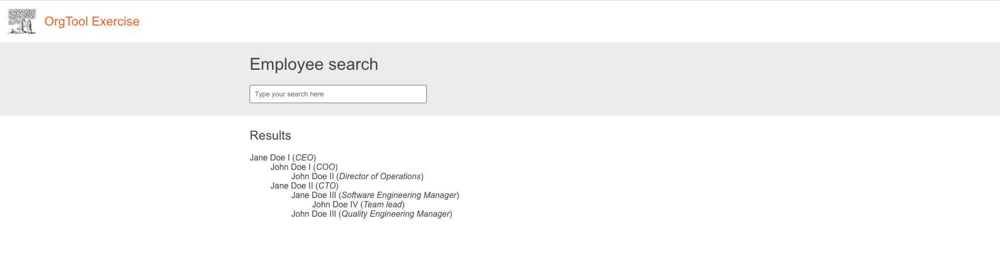
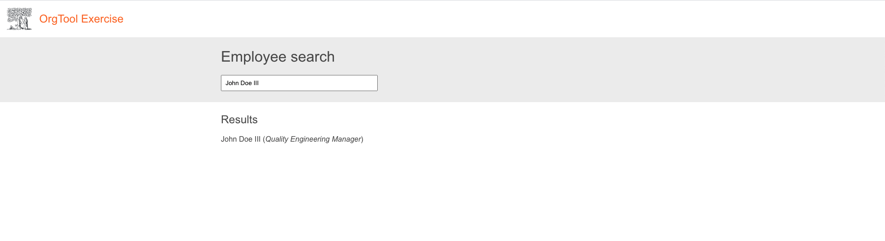
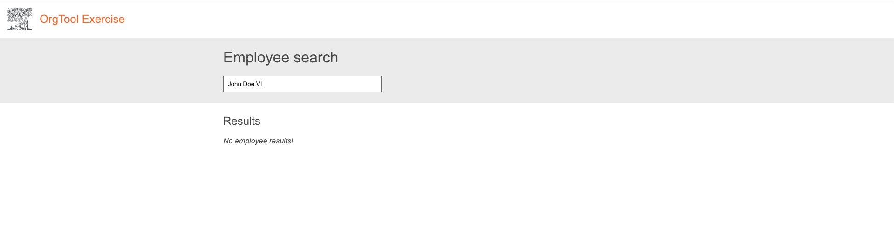

# OrgTool exercise

## Exercise

- Implement the user interface similar to the one pictured on screenshots below (don't worry about styles too much):

  1. Basic UI with 3 sections. Header, search bar and results.
  The list of employees must be retrieved from the [API mockup](http://localhost:4000/employees).
  
  
  2. Implement a basic case-insensitive filter for employees in any point of the hypothetical organization hierarchy. E.g.: `on doe ii` must match `John Doe II` and `John Doe III`.
  
  
  3. Display message stating that no match could be found.
  

  _Note: The orange color found on the prototype is `#f36d21`. The gray color is `#eee`_
  
- Fetch the data from /api/db.json using an HTTP call made by your application. Note the nested structure of the json object.
- You can use any JavaScript framework, library or tool you find necessary
- Technical requirement: Each employee list item should be a recursive `Employee` component.
- Configure/implement/run/analyze _anything_ else you consider important! Explain why you decided to do that.
- Please document your assumptions about the API, information architecture, or the project itself, if any.
- Feel free to configure any tooling you deem important. Please update the `Instructions to run` section above in case anything gets added/changed.
- The exercise will be analyzed holistically. That means that not only the functionality, but non-functional requirements will also be assessed.

## Instructions to run the mock API server

`npm install` install dependencies

`npm run api:run` to run the API mockup serving db.json

## Notes
- [Edit this section if you want add any notes]
